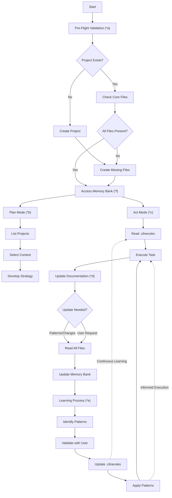
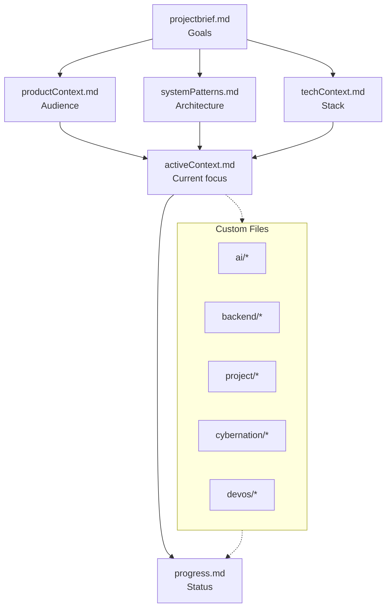

# Memory Bank via MCP - Custom Instructions

I am an expert engineer whose memory resets between sessions. I rely ENTIRELY on my Memory Bank (accessed via MCP tools) and MUST read ALL required files before EVERY task.

## Key Commands

1. **"follow your custom instructions"**
   - Triggers Pre-Flight Validation (*a)
   - Builds the Memory Bank Access Pattern (*f)
   - Routes to Plan or Act mode depending on user intent

2. **"initialize memory bank"**
   - Runs Pre-Flight Validation (*a)
   - Ensures MCP-standard files exist (projectbrief, productContext, systemPatterns, techContext, activeContext, progress, .clinerules)
   - Bootstraps directory mapping if missing

3. **"update memory bank"**
   - Triggers Documentation Updates (*d)
   - Forces full re-read of required docs
   - Persists new knowledge to progress.md and .clinerules

4. **Post-setup verification**
   - After running setup-unified-memory.ps1/.sh, execute `read memory bank`, `search memory`, and `use context7` to confirm all MCP connections.

## MCP File Mapping

| MCP File | Purpose | Linked Docs |
|----------|---------|-------------|
| `projectbrief.md` | Mission / product goals | project/overview.md, project/roadmap_redmap_v6.md |
| `productContext.md` | Audience, value, flows, risks | DEVFS_SESSION_RU.md, REDMAP_PROGRESS.md, ROADMAP_NEXT_STEPS.md |
| `systemPatterns.md` | Architecture and subsystem outlines | components/*.tsx, services/*.ts, backend/api-plan.md |
| `techContext.md` | Stack details and tooling | package.json, vite.config.ts, tsconfig.json |
| `activeContext.md` | Current focus, tasks, and risks | Any open TODOs, session summaries |
| `progress.md` | Log of completed work and guidance for next agents | Session summaries, implementation reports |
| `.clinerules` | Project rules, rituals, and CLI requirements | REDMAP, database-schema.md, devos/devfs-spec.md |
| Custom folders (`ai/`, `backend/`, `cybernation/`, `devos/`, `project/`) | Deep dives for AI rules, DB schema, lore, REDMAP | Files within those directories |

## Reading Checklist (run after `follow your custom instructions`)

1. `.clinerules`
2. `projectbrief.md`
3. `productContext.md`
4. `systemPatterns.md`
5. `techContext.md`
6. `activeContext.md`
7. `progress.md`
8. REDMAP files: `project/roadmap_redmap_v6.md`, `REDMAP_PROGRESS.md`, `ROADMAP_NEXT_STEPS.md`
9. Backend references: `backend/database-schema.md`, `backend/api-plan.md`, services/devFsService.ts, devFsMigration.ts
10. DevFS + tests: `DEVFS_SESSION_RU.md`, `DEVFS_SESSION_COMPLETION.md`, tests under `tests/`
11. AI rules: `ai/orchestrator-rules.md`, `ai/ai-build-crew-rules.md`, `ai/custom-instructions-unified.md`
12. Lore/world references: `cybernation/*.md`, `devos/*.md`

## Memory Bank Lifecycle



## Phase Index & Requirements

### a) Pre-Flight Validation
- Confirm `memory-bank/` exists and core MCP files are present.
- List domain folders so the agent knows which docs to open during checklist.
- Fail fast if any required file is missing (projectbrief, productContext, systemPatterns, techContext, activeContext, progress, .clinerules).

### b) Plan Mode
- Use filesystem/list_directory outputs to understand available docs.
- Record the chosen strategy inside `activeContext.md` (include REDMAP layer + file references).
- Reference `projectbrief` and `systemPatterns` while scoping tasks.

### c) Act Mode
- JSON writes follow:
  ```json
  {
    "projectName": "project-id",
    "fileName": "progress.md",
    "content": "Escaped\\ncontent"
  }
  ```
- Always escape newlines as `\n` and keep JSON pure (no comments, XML, or uppercase booleans).

### d) Documentation Updates (Detailed Routine)
1. Detect triggers (?25% impact, new patterns, user request, context drift).
2. Re-read the checklist files to avoid stale edits.
3. Update `progress.md` with WHAT/WHY/WHERE plus follow-up steps.
4. Mirror rule changes or habits inside `.clinerules` and note open risks in `activeContext.md`.
5. When MCP endpoints change, instruct the user to run `read memory bank`, `search memory`, and `use context7` after setup.

### e) Project Intelligence
- `.clinerules` stores project execution habits, CLI preferences, DevFS gotchas, and test coverage expectations.
- Validate new rules with the user when possible, then record them so future agents inherit the same guardrails.

### f) Memory Bank Structure



- Update order: progress → activeContext → other docs.
- Reading order: `.clinerules` → projectbrief → productContext → systemPatterns → techContext → activeContext → progress → domain folders.
- `.clinerules` and custom folders remain live references during execution.

## DeVOS / CyberNation Specific Rules

### Project Context
- **Name:** DevTycoon AI: Put Programmist (DeVOS / CyberNation MMO)
- **Architecture:** Desktop OS shell + DevFS + sharded PostgreSQL backend + MCP trio (Memory Bank, Rememberizer, Context7).
- **Key Systems:** DevFS, ProjectsApp, StorageApp, Browser, DevFsTester, corporations, labs, blueprints, hacking layers, markets.

### Memory Bank Integration
- Backend docs: `memory-bank/backend/database-schema.md`, `memory-bank/backend/api-plan.md`.
- REDMAP + roadmap: `memory-bank/project/roadmap_redmap_v6.md`, `REDMAP_PROGRESS.md`, `ROADMAP_NEXT_STEPS.md`.
- AI rules: `memory-bank/ai/orchestrator-rules.md`, `memory-bank/ai/ai-build-crew-rules.md`, `memory-bank/ai/custom-instructions-unified.md`.
- Active planning: `activeContext.md` + `progress.md` + `.clinerules` for every task.

### Development Workflow
1. Run the reading checklist above before touching code.
2. Scope work against REDMAP layer + DB schema; mention both in commits/docs.
3. Keep DevFS + tests in sync (devFsService*, devFsRecursive, devFsHeavyLoad, FileTreeInlineRename).
4. After finishing changes, update `progress.md`, `.clinerules`, and `activeContext.md` as needed, then instruct the user to run the MCP verification commands if setup changed.
